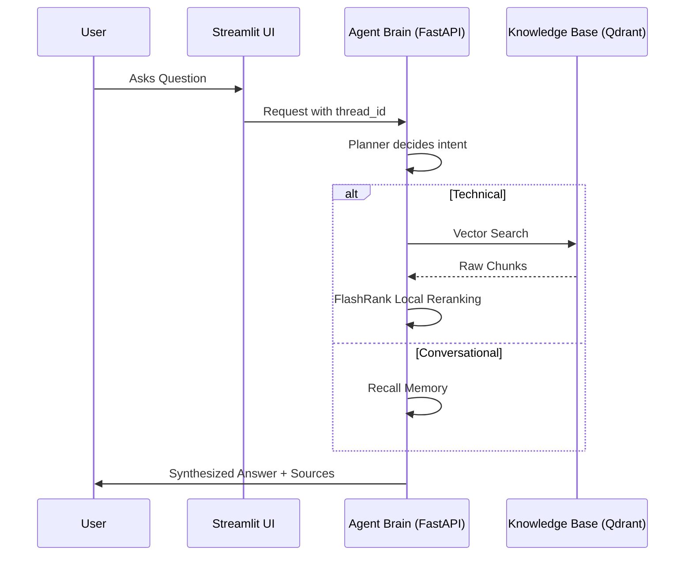

# 🤖 Enterprise Agentic RAG: System Overview

> ✅ **Current** — reflects the running system (local-first, post-GCP migration). Last updated 2026-09-14.

A pragmatic agentic RAG system built for grounded answers and observability. It leverages **LangGraph** for multi-step reasoning and runs **fully local/free for compute** — CPU embeddings and reranking — using only **Qdrant Cloud** (vectors) and **Groq** (LLM) as hosted services. No GCP.

---

## 🌟 Vision
Most RAG systems fail because they treat every query the same. Our **Agentic RAG** distinguishes between:
1.  **Conversational Queries**: "Hi", "Who are you?", "What did I just say?"
2.  **Technical Queries**: "How do I configure Intel SRIOV on Kubernetes?"

By using a **Guardrail → Planner → Retriever → Grader → Responder** graph, technical answers stay grounded in retrieved context (with a self-correction retry, and an honest "not in the knowledge base" when coverage is missing), while conversational interactions remain fluid and fast.

---

## 🏗️ High-Level Flow

---

## 📂 Project Organization
*   **`app/`**: The core Python package containing the Agent, Pipelines, and Services.
*   **`ui/`**: A premium Streamlit interface designed for source transparency.
*   **`DATA/`**: The ground-truth documentation used for ingestion.
*   **`DOCS/`**: This documentation suite.
*   **`commands.md`**: The master execution guide for developers.

---

## 🚀 Quick Navigation
1.  **Ingestion**: [02_INGESTION_ENGINE.md](02_INGESTION_ENGINE.md)
2.  **Intelligence**: [03_NODE_INTELLIGENCE.md](03_NODE_INTELLIGENCE.md)
3.  **Observability**: [04_TRACING_AND_OBSERVABILITY.md](04_TRACING_AND_OBSERVABILITY.md)
4.  **Cloud Architecture**: [09_INFRA_ARCHITECTURE.md](09_INFRA_ARCHITECTURE.md)
