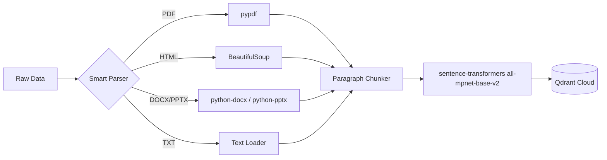

# 📥 Ingestion Engine: Data to Knowledge

> ✅ **Current** — reflects the running system (local-first, post-GCP migration). Last updated 2026-09-14.

The Ingestion Engine is a modular pipeline that converts raw enterprise data into a searchable vector format — entirely on your CPU, with no cloud parsing or embedding service.

## 🔄 The Pipeline Flow


---

## 🛠️ Technical Specifications

### 1. Local Parsing (No Cloud)
All parsing runs locally — nothing is sent to a cloud parsing API:
*   **PDFs (`pypdf`)**: Text is extracted page-by-page with `pypdf`. Note: this reads the embedded text layer only; scanned/image-only PDFs return no text (they'd need a local OCR step, which is intentionally not included).
*   **HTML**: Processed via **BeautifulSoup**, stripping `<script>`, `<style>`, and metadata to keep only readable content.
*   **Office Docs**: `.docx` via **python-docx** and `.pptx` via **python-pptx** (including table and slide text).
*   **Text**: read directly as UTF-8.

### 2. Semantic Chunking
*   **Chunk Size**: `1500` characters.
*   **Overlap**: Natural overlap (we split by paragraph breaks `\n\n` rather than arbitrary character counts).
*   **Logic**: The system uses a semantic-ish, paragraph-aware splitter. It attempts to keep paragraphs together to maintain context, ensuring that no chunk is cut off mid-sentence whenever possible. This prevents the LLM from getting "hallucinated" fragments.

### 3. Vectorization & Storage
*   **Embedding Model**: `sentence-transformers/all-mpnet-base-v2` — a local, free model that runs on CPU (downloaded once to the HuggingFace cache).
*   **Vector Dimensions**: `768` dimensions (matches the Qdrant collection config).
*   **Vector Database**: **Qdrant**. We use a Cloud-hosted Qdrant instance for low-latency retrieval.
*   **Distance Metric**: **Cosine Similarity** (`models.Distance.COSINE`) is used to measure how closely a user query matches our document chunks.

---

## 🌍 Universal Ingestion Command
The engine is "Universal," meaning it automatically detects folder structures and maps them to metadata (e.g., "True" vs "Noisy" data).

```powershell
# Command to run the full ingestion
python -m app.ingestion.processor DATA --wipe
```
