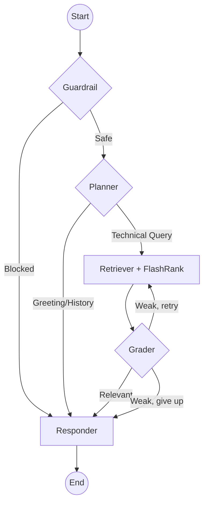

# 🧠 Node Intelligence: The Agentic Brain

> ✅ **Current** — reflects the running system (local-first, post-GCP migration). Last updated 2026-09-14. The live graph has **five** nodes: Guardrail → Planner → Retriever → Grader → Responder.

The project uses a **Cyclic State Machine** powered by **LangGraph**. Unlike standard RAG, our agent doesn't just search; it *thinks* about whether a search is even necessary — and *grades* what it retrieves before answering.

---

## 🤖 The Graph Nodes

### 1. 🧭 The Planner Node
*   **Model**: Groq `gpt-oss-20b` (fast classifier)
*   **Logic**: The Planner is the entry point. It analyzes the entire conversation history and the new user message.
*   **Decisions**:
    *   `CONVERSATIONAL`: If the user says "Hi" or asks about something already in the chat memory, it skips the expensive search process.
    *   `TECHNICAL`: If the user asks a question about Kubernetes, Intel, or Networking, it generates a refined, optimized search query.

### 2. 🔍 The Retriever Node
*   **Services**: Qdrant Cloud (Vector Search) + FlashRank (Local Semantic Reranker)
*   **Mechanics: The Two-Stage Retrieval Pipeline**:
    *   **Stage 1 - Fast Bi-Encoder Retrieval (Qdrant)**:
        *   We convert the user query into a 768-dimensional vector using the local `sentence-transformers/all-mpnet-base-v2` model.
        *   We perform a **Cosine Similarity** search in Qdrant to find the top **15** candidates.
        *   *Why?* This is extremely fast (sub-10ms) because it only compares pre-calculated vectors. However, it lacks deep semantic understanding of the relationship between the query and the text.
    *   **Stage 2 - Deep Cross-Encoder Reranking (FlashRank)**:
        *   The top 15 candidates are passed to **FlashRank**, which uses a **Cross-Encoder** model (`ms-marco-MiniLM-L-6-v2`).
        *   Unlike the Bi-Encoder, the Cross-Encoder processes the query and the document *together* at the same time, allowing it to understand nuances like negation, complex relationships, and technical context.
        *   *Why FlashRank?* Normally, Cross-Encoders are heavy and expensive. FlashRank uses highly optimized ONNX models that run **locally on your CPU** with almost zero latency, providing "Gold Standard" reranking without any extra API costs.
    *   **Final Output**: Only the top **5** reranked documents are sent to the LLM. This ensures the LLM receives the most concentrated, high-signal information possible.
    *   **Zero-Downtime Fallback**: If the FlashRank model fails to load or errors out, the node gracefully falls back to the original Qdrant scores.

### 3. ✍️ The Responder Node
*   **Model**: Groq `gpt-oss-120b` (answer synthesis)
*   **Logic**: This is the final synthesizer. It takes the retrieved documents (if any) and the conversation history to generate a natural, helpful response. 
*   **Sources**: It is instructed to cite its sources and use only the provided context for technical answers.
*   **Token budget**: retrieved chunks are capped before synthesis to stay under Groq's free-tier per-request token limit.

### 4. 🛡️ The Guardrail Node (entry gate)
*   **Model**: Groq `gpt-oss-20b`
*   **Logic**: Runs *before* the Planner. Blocks jailbreak attempts, unsafe, or clearly out-of-scope requests. Fails **open** (allows) on any error so it never takes the assistant down. (This is a lightweight LLM gate — not NeMo Guardrails; see [15_GUARDRAILS.md](15_GUARDRAILS.md).)

### 5. ⚖️ The Grader Node (self-correction)
*   **Model**: Groq `gpt-oss-20b` (+ a retrieval-score sanity check)
*   **Logic**: After retrieval, grades whether the top chunks actually answer the question. Trusts strong retrieval scores (≥ 0.55 cosine); rejects very weak ones (< 0.35). On weak-but-plausible context it **rewrites the query and retries once**; if it still fails, it routes to the Responder to honestly say the answer isn't in the knowledge base — preventing hallucination.

---

## ⛓️ Workflow Visualization

---

## 💾 State & Memory
*   **Memory**: The graph uses `MemorySaver`. This allows the agent to maintain a "thread" of conversation. Even if the backend restarts, the agent can recall previous turns if the same `thread_id` is used.
*   **State**: The `AgentState` object tracks:
    *   `messages`: The full chat history.
    *   `current_query`: The optimized search term.
    *   `documents`: The reranked technical context.
    *   `plan`: A log of "thought steps" displayed in the UI.
