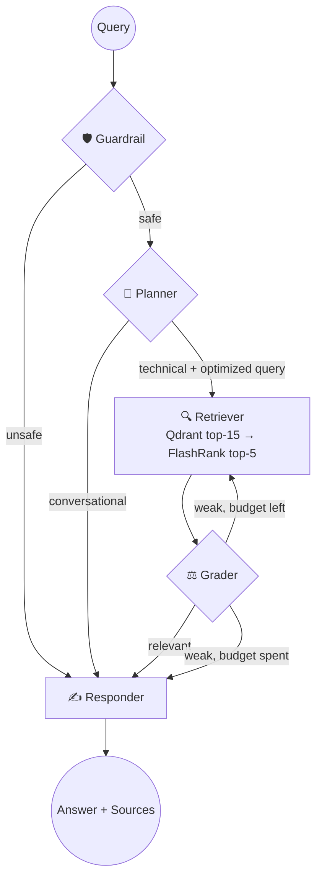

# 🧠 Enterprise Agentic RAG

An agentic Retrieval-Augmented Generation system that **decides whether to search before it answers**. Built with **LangGraph**, it routes small talk straight to the LLM, sends real questions through a two-stage retrieval pipeline, and **grades its own retrieved context** — refusing to answer (instead of hallucinating) when the knowledge base doesn't cover the question.

It runs **fully local/free for the compute-heavy parts**: embeddings and reranking happen on your CPU, with only the vector database (Qdrant Cloud, free tier) and the LLM (Groq, free tier) as hosted services. **No GCP, no paid infrastructure.**

> **Status:** the ingestion → retrieval → agent → API → UI path is implemented and working end-to-end (1,876 vectors indexed from the sample corpus). See [What's actually built](#-whats-actually-built) for the honest scope.

---

## What it does

1. **Ingests** PDFs, HTML, Word, PowerPoint, and text files → extracts text → chunks → embeds locally → indexes into Qdrant.
2. **Answers questions** through a LangGraph agent that:
   - gates unsafe/off-topic input,
   - routes chit-chat vs. technical questions,
   - retrieves + reranks context,
   - **grades relevance and self-corrects** (rewrite & retry, then honestly says "not in the knowledge base"),
   - synthesizes a **cited** answer.
3. **Serves** it via a FastAPI backend and a Streamlit chat UI, containerized with Docker and deployable to Hugging Face Spaces.

---

## 🕸️ The Agent Graph



| Node | Model | Job |
|------|-------|-----|
| 🛡️ **Guardrail** | Groq `gpt-oss-20b` | Blocks jailbreaks / unsafe / off-scope input (fail-open). |
| 🧭 **Planner** | Groq `gpt-oss-20b` | Routes `conversational` vs `technical`; emits an optimized, history-aware search query. |
| 🔍 **Retriever** | — | Qdrant cosine search (top 15) → FlashRank cross-encoder rerank (top 5). |
| ⚖️ **Grader** | Groq `gpt-oss-20b` | Grades context relevance; **rewrites & retries once**, then gives up gracefully. Trusts strong retrieval scores. |
| ✍️ **Responder** | Groq `gpt-oss-120b` | Synthesizes a grounded, **source-cited** answer — or chit-chat, or an honest "not found". |

Conversation memory is kept per `thread_id` via LangGraph's `MemorySaver` (in-process).

---

## 🧰 Tech Stack

| Layer | Technology | Where |
|-------|-----------|-------|
| Agent orchestration | **LangGraph** (`StateGraph` + `MemorySaver`) | `app/agents/` |
| LLM | **Groq** — `gpt-oss-120b` (answers) + `gpt-oss-20b` (routing) | `app/llm/client.py` |
| Embeddings | **`sentence-transformers/all-mpnet-base-v2`** (768-dim, local CPU) | `app/services/retrieval/embedding.py` |
| Vector DB | **Qdrant Cloud** (free tier) | `app/services/retrieval/qdrant_service.py` |
| Reranking | **FlashRank** cross-encoder (local ONNX, zero-cost) | `app/services/retrieval/reranking_service.py` |
| PDF / office parsing | **pypdf**, python-docx, python-pptx, BeautifulSoup | `app/ingestion/loaders/` |
| API | **FastAPI** + uvicorn | `app/main.py` |
| UI | **Streamlit** (HTTP or in-process mode) | `ui/app.py` |
| Observability | **Pydantic Logfire** (optional) | throughout |
| Packaging | **Docker** + Docker Compose; **Hugging Face Spaces** | root |

The LLM is created through a small `get_llm()` factory that uses **direct Groq** today and transparently switches to a **Portkey gateway** if `PORTKEY_API_KEY` is set — no node code changes required.

---

## 📁 Project Structure

```text
app/
├── config.py                     # settings from .env (Groq, Qdrant, models)
├── main.py                       # FastAPI: POST /query, GET /health
├── llm/
│   └── client.py                 # get_llm() — Groq now, Portkey seam
├── agents/
│   ├── state.py                  # AgentState (messages accumulate via reducer)
│   ├── graph.py                  # build_graph(), run_turn(), compiled `agent`
│   └── nodes/
│       ├── guardrail.py          # input safety/scope gate
│       ├── planner.py            # router + query optimizer
│       ├── retriever.py          # Qdrant search + FlashRank rerank
│       ├── grader.py             # relevance grade + self-correction loop
│       └── responder.py          # cited answer / chit-chat / not-found
├── ingestion/
│   ├── processor.py              # ingestion pipeline (parse → chunk → embed → index)
│   ├── chunking/splitter.py
│   └── loaders/                  # pdf.py, html.py, office.py, text.py
└── services/retrieval/
    ├── embedding.py              # local sentence-transformers
    ├── qdrant_service.py         # search_enterprise_knowledge()
    └── reranking_service.py      # rerank_documents()

ui/app.py                         # Streamlit chat frontend
test_query.py                     # CLI: retrieval-only smoke test

Dockerfile                        # Hugging Face Space (single Streamlit container, in-process agent)
Dockerfile.api / Dockerfile.ui    # Docker Compose services
docker-compose.yml                # api (:8000) + ui (:8501)
requirements.txt                  # full dev deps
requirements-app.txt              # trimmed runtime deps (for the Space)

DATA/                             # sample corpus (true_data / noisy_data)
DOCS/                             # original design blueprints (see note below)
local_store/                      # raw + processed artifacts (gitignored)
```

---

## 🚀 Getting Started

### 1. Install
```bash
python -m venv enterprise_env
source enterprise_env/Scripts/activate   # Windows Git Bash; use .\enterprise_env\Scripts\activate on PowerShell
pip install -r requirements.txt
```

### 2. Configure `.env`
```dotenv
GROQ_API_KEY="gsk_..."
QDRANT_API_KEY="..."
QDRANT_CLUSTER_ENDPOINT="https://<cluster>.cloud.qdrant.io"
# optional overrides
GROQ_MODEL="openai/gpt-oss-120b"
GROQ_FAST_MODEL="openai/gpt-oss-20b"
LOGFIRE_TOKEN="..."               # optional observability
```
> Groq retires models periodically. If a call returns `model_not_found`, pick a current one from https://console.groq.com/docs/models and set `GROQ_MODEL` / `GROQ_FAST_MODEL`.

### 3. Ingest documents
```bash
python -m app.ingestion.processor DATA --wipe
```
Parses everything under `DATA/`, embeds locally, and indexes into Qdrant. `--wipe` recreates the collection first. Raw + processed copies are saved under `local_store/`.

### 4. Run it — two terminals
```bash
uvicorn app.main:app --reload --port 8000
```
```bash
streamlit run ui/app.py
```
Open **http://localhost:8501**.

### 5. Or with Docker
```bash
docker compose up --build
```
UI on `:8501`, API on `:8000`. First build pulls torch and downloads the embedding model into a cached volume.

---

## ☁️ Deploy & Share (Hugging Face Spaces)

The root `Dockerfile` runs a **single Streamlit container with the agent in-process** (no separate API to expose) — ideal for a free, public, shareable demo.

1. Create a **Docker** Space at https://huggingface.co/new-space (CPU basic, Public).
2. Push `app/`, `ui/`, `Dockerfile`, and `requirements-app.txt` to the Space repo.
3. In **Settings → Secrets**, add `GROQ_API_KEY`, `QDRANT_API_KEY`, `QDRANT_CLUSTER_ENDPOINT`.
4. HF builds the image (bakes the embedding model) and serves it at your public URL.

> A public demo runs on your keys and is subject to Groq's free-tier rate limits (8k tokens/min); the app handles rate-limit errors gracefully.

---

## ✅ What's actually built

Implemented and verified end-to-end:
- ✅ Local ingestion (pypdf/office/html/text → chunk → **local** embeddings → Qdrant)
- ✅ Two-stage retrieval (Qdrant + FlashRank)
- ✅ Full LangGraph agent: guardrail · planner · retriever · grader/self-correction · responder
- ✅ FastAPI backend + Streamlit UI (HTTP and in-process modes)
- ✅ Docker Compose + Hugging Face Space packaging

**Roadmap / not yet wired in** (the `DOCS/` folder describes the original, broader design vision — parts of it are aspirational or were intentionally superseded when the project migrated off GCP to a local-first stack):
- ⏳ Portkey LLM gateway — code seam exists in `get_llm()`, activates when `PORTKEY_API_KEY` is set
- ⏳ NeMo Guardrails — currently a lightweight LLM-based guardrail node instead
- ⏳ Redis-backed conversation memory (currently in-process `MemorySaver`)
- ⏳ RAGAS evaluation suite
- ⏳ GCP deployment — **removed**; replaced by local embeddings + Docker/HF Spaces

> **Note on `DOCS/`:** these are the original architecture blueprints written before the local-first migration. They still reference Vertex AI embeddings, Document AI, GCP Cloud Run, and an active Portkey/NeMo setup. Treat them as design background; this README reflects the code as it actually runs today.

---

*A pragmatic, free-to-run take on enterprise document intelligence.*
